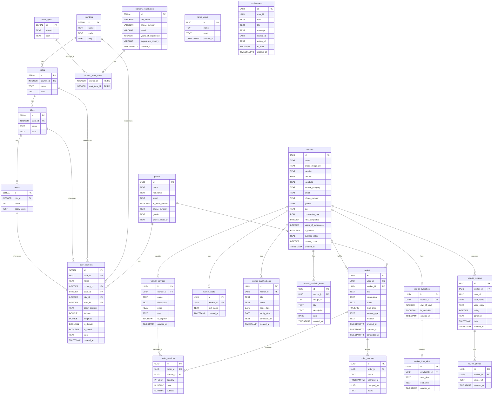

<div align="center">

  
  <h1>SOHOJOGI</h1>
  
<!-- Badges -->
<p>
  <a href="https://github.com/Learnathon-By-Geeky-Solutions/team-synergy/graphs/contributors">
    
  </a>
  <a href="">
    
  </a>
  <a href="https://github.com/Learnathon-By-Geeky-Solutions/team-synergy/network/members">
    
  </a>
  <a href="https://github.com/Learnathon-By-Geeky-Solutions/team-synergy/stargazers">
    
  </a>
  <a href="https://github.com/Learnathon-By-Geeky-Solutions/team-synergy/issues/">
    
  </a>
  <a href="https://github.com/Learnathon-By-Geeky-Solutions/team-synergy/blob/master/LICENSE">
    
  </a>
</p>

<!-- SonarCloud Quality Badges -->
<p>
  <a href="https://sonarcloud.io/dashboard?id=Learnathon-By-Geeky-Solutions_team-synergy">
    
  </a>
</p>

<p>
  <a href="https://sonarcloud.io/component_measures/domain/Vulnerability?id=Learnathon-By-Geeky-Solutions_team-synergy">
    
  </a>
  <a href="https://sonarcloud.io/component_measures/domain/Bugs?id=LLearnathon-By-Geeky-Solutions_team-synergy">
    
  </a>
  <a href="https://sonarcloud.io/component_measures/domain/Security?id=LLearnathon-By-Geeky-Solutions_team-synergy">
    
  </a>
  <a href="https://sonarcloud.io/component_measures/metric/reliability_rating/list?id=Learnathon-By-Geeky-Solutions_team-synergy">
    
  </a>
  <a href="https://sonarcloud.io/component_measures/metric/code_smells/list?id=Learnathon-By-Geeky-Solutions_team-synergy">
    
  </a>
</p>

<h4>
  <a href="https://github.com/Learnathon-By-Geeky-Solutions/team-synergy">Documentation</a>
  <span> · </span>
  <a href="https://github.com/Learnathon-By-Geeky-Solutions/team-synergy/issues/">Report Bug</a>
  <span> · </span>
  <a href="https://github.com/Learnathon-By-Geeky-Solutions/team-synergy/issues/">Request Feature</a>
</h4>
</div>


# SOHOJOGI - One Stop Home Service Solutions

## 📚 Project Resources

<div align="center">
  <p>
    <a href="resources/pitch-deck.pdf">
      
    </a>
    <a href="resources/DevLog.md">
      
    </a>
    <a href="resources/Wireframe.pdf">
      
    </a>
    <a href="https://www.figma.com/proto/WzVr7zvjiAiGrVoSkEglZE/Sohojogi-App-UI?node-id=125-186&starting-point-node-id=125%3A186&t=BygQA84Hiw98dmrB-1">
      
    </a>
  </p>
</div>

## 📋 Project Description
"SOHOJOGIˮ is a one-stop service provider platform for daily household tasks.
It connects users with skilled professionals like plumbers, electricians, mechanics, and appliance repair experts, making it easy to find and hire reliable help.

## 🚀 Getting Started

### Prerequisites
Make sure you have the following tools installed on your system:
- **Flutter SDK**: [Install Flutter](https://docs.flutter.dev/get-started/install)
- **Android Studio** (for Android development)
- **Git**: [Download Git](https://git-scm.com/)

Verify Flutter installation:
```sh
flutter doctor
```

### Project Setup Instructions
1. Clone the repository:
   ```bash
   git clone https://github.com/Learnathon-By-Geeky-Solutions/team-synergy.git
   ```
2. Install dependencies:
   ```bash
   flutter pub get
   ```
3. Run the application:
   ```bash
   flutter run
   ```

## 🏗️ Technical Architecture

| Category | Technology/Pattern |
|----------|-------------------|
| **Architecture Pattern** | MVVM (Model-View-ViewModel) |
| **State Management** | Provider |
| **Remote Database** | Supabase |
| **Authentication** | Supabase Auth |
| **UI Framework** | Flutter Material Design |
| **Language** | Dart |
| **Backend Services** | • User Management<br>• Worker Management<br>• Order Management<br>• Review System<br>• Notifications |
| **Key Features** | • Dark/Light Theme<br>• Multi-language Support<br>• Profile Management<br>• Business Profiles<br>• Location Services |
| **Database Structure** | • User Profiles<br>• Worker Profiles<br>• Service Listings<br>• Orders<br>• Reviews<br>• Locations |

## 📁 Project Structure

The structure follows clean architecture principles with:
- `lib/`: Main source code
  - `base/`: Core services and utilities
  - `constants/`: App-wide constants
  - `data/`: Data layer (models, repositories)
  - `screens/`: Feature modules following MVVM
  - `utils/`: Helper functions and utilities
- `test/`: Test files
- `assets/`: Static resources

## 💾 Database Schema




## 👥 Team

| Role | Name |
|------|------|
| **Team Leader** | Afnan Rakib |
| **Team Member** | Md. Rubayet Islam |
| **Team Member** | Rajiun Nabi |
| **Mentor** | Shahriar Rahman Shaon |

## 📄 License
This project is licensed under the MIT License - see the [LICENSE](LICENSE) file for details.