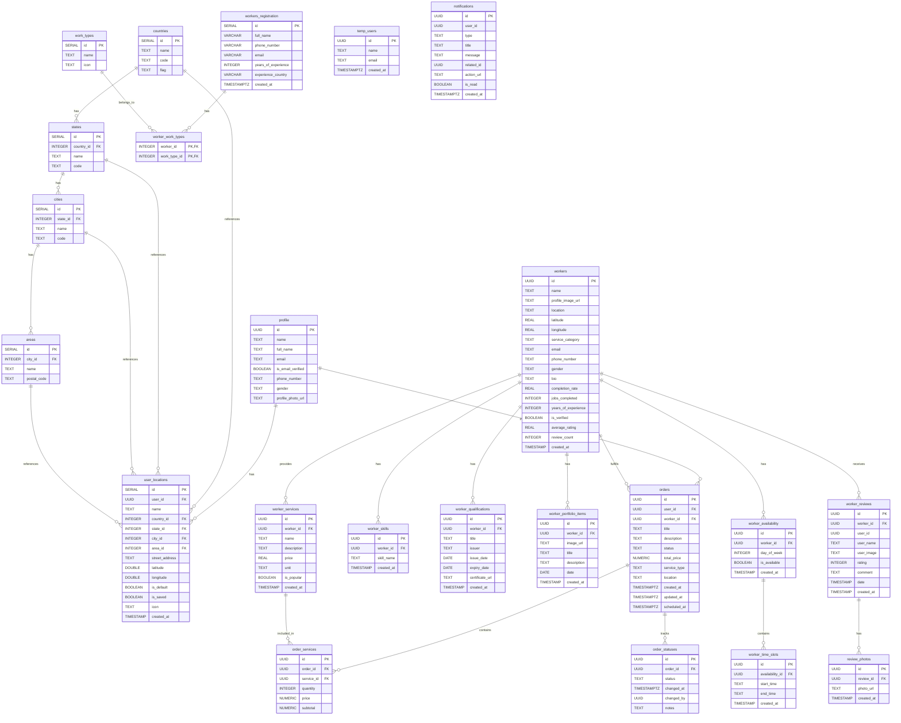

# Database Schema

```mermaid
erDiagram
    countries ||--o{ states : has
    states ||--o{ cities : has
    cities ||--o{ areas : has
    
    profile ||--o{ user_locations : has
    countries ||--o{ user_locations : references
    states ||--o{ user_locations : references
    cities ||--o{ user_locations : references
    areas ||--o{ user_locations : references
    
    workers ||--o{ worker_services : provides
    workers ||--o{ worker_skills : has
    workers ||--o{ worker_qualifications : has
    workers ||--o{ worker_portfolio_items : has
    workers ||--o{ worker_availability : has
    worker_availability ||--o{ worker_time_slots : contains
    
    workers ||--o{ worker_reviews : receives
    worker_reviews ||--o{ review_photos : has
    
    profile ||--o{ orders : places
    workers ||--o{ orders : fulfills
    orders ||--o{ order_services : contains
    worker_services ||--o{ order_services : included_in
    orders ||--o{ order_statuses : tracks
    
    workers_registration ||--o{ worker_work_types : has
    work_types ||--o{ worker_work_types : belongs_to

    countries {
        SERIAL id PK
        TEXT name
        TEXT code
        TEXT flag
    }
    
    states {
        SERIAL id PK
        INTEGER country_id FK
        TEXT name
        TEXT code
    }
    
    cities {
        SERIAL id PK
        INTEGER state_id FK
        TEXT name
        TEXT code
    }
    
    areas {
        SERIAL id PK
        INTEGER city_id FK
        TEXT name
        TEXT postal_code
    }
    
    profile {
        UUID id PK
        TEXT name
        TEXT full_name
        TEXT email
        BOOLEAN is_email_verified
        TEXT phone_number
        TEXT gender
        TEXT profile_photo_url
    }
    
    temp_users {
        UUID id PK
        TEXT name
        TEXT email
        TIMESTAMPTZ created_at
    }
    
    user_locations {
        SERIAL id PK
        UUID user_id FK
        TEXT name
        INTEGER country_id FK
        INTEGER state_id FK
        INTEGER city_id FK
        INTEGER area_id FK
        TEXT street_address
        DOUBLE latitude
        DOUBLE longitude
        BOOLEAN is_default
        BOOLEAN is_saved
        TEXT icon
        TIMESTAMP created_at
    }
    
    work_types {
        SERIAL id PK
        TEXT name
        TEXT icon
    }
    
    workers {
        UUID id PK
        TEXT name
        TEXT profile_image_url
        TEXT location
        REAL latitude
        REAL longitude
        TEXT service_category
        TEXT email
        TEXT phone_number
        TEXT gender
        TEXT bio
        REAL completion_rate
        INTEGER jobs_completed
        INTEGER years_of_experience
        BOOLEAN is_verified
        REAL average_rating
        INTEGER review_count
        TIMESTAMP created_at
    }
    
    worker_services {
        UUID id PK
        UUID worker_id FK
        TEXT name
        TEXT description
        REAL price
        TEXT unit
        BOOLEAN is_popular
        TIMESTAMP created_at
    }
    
    worker_skills {
        UUID id PK
        UUID worker_id FK
        TEXT skill_name
        TIMESTAMP created_at
    }
    
    worker_qualifications {
        UUID id PK
        UUID worker_id FK
        TEXT title
        TEXT issuer
        DATE issue_date
        DATE expiry_date
        TEXT certificate_url
        TIMESTAMP created_at
    }
    
    worker_portfolio_items {
        UUID id PK
        UUID worker_id FK
        TEXT image_url
        TEXT title
        TEXT description
        DATE date
        TIMESTAMP created_at
    }
    
    worker_availability {
        UUID id PK
        UUID worker_id FK
        INTEGER day_of_week
        BOOLEAN is_available
        TIMESTAMP created_at
    }
    
    worker_time_slots {
        UUID id PK
        UUID availability_id FK
        TEXT start_time
        TEXT end_time
        TIMESTAMP created_at
    }
    
    orders {
        UUID id PK
        UUID user_id FK
        UUID worker_id FK
        TEXT title
        TEXT description
        TEXT status
        NUMERIC total_price
        TEXT service_type
        TEXT location
        TIMESTAMPTZ created_at
        TIMESTAMPTZ updated_at
        TIMESTAMPTZ scheduled_at
    }
    
    order_services {
        UUID id PK
        UUID order_id FK
        UUID service_id FK
        INTEGER quantity
        NUMERIC price
        NUMERIC subtotal
    }
    
    order_statuses {
        UUID id PK
        UUID order_id FK
        TEXT status
        TIMESTAMPTZ changed_at
        UUID changed_by
        TEXT notes
    }
    
    worker_reviews {
        UUID id PK
        UUID worker_id FK
        UUID user_id
        TEXT user_name
        TEXT user_image
        INTEGER rating
        TEXT comment
        TIMESTAMP date
        TIMESTAMP created_at
    }
    
    review_photos {
        UUID id PK
        UUID review_id FK
        TEXT photo_url
        TIMESTAMP created_at
    }
    
    notifications {
        UUID id PK
        UUID user_id
        TEXT type
        TEXT title
        TEXT message
        UUID related_id
        TEXT action_url
        BOOLEAN is_read
        TIMESTAMPTZ created_at
    }
    
    workers_registration {
        SERIAL id PK
        VARCHAR full_name
        VARCHAR phone_number
        VARCHAR email
        INTEGER years_of_experience
        VARCHAR experience_country
        TIMESTAMPTZ created_at
    }
    
    worker_work_types {
        INTEGER worker_id PK,FK
        INTEGER work_type_id PK,FK
    }
```
